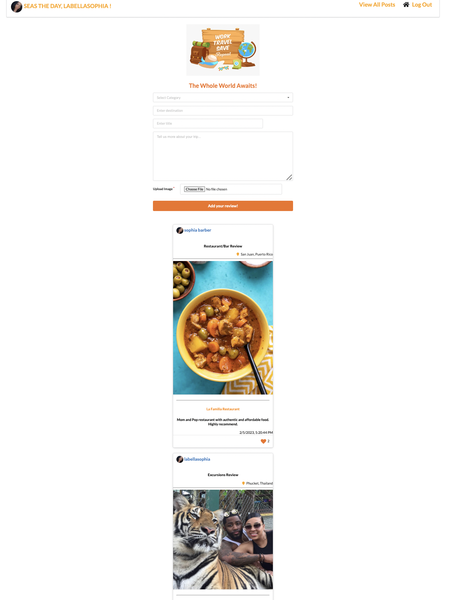

# Sophia Barber

## Project Name: traveloSOPHY
- - -
Game-Link: https://blue-cheerful-bull.cyclic.app/

- - -
## traveloSOPHY Overview
- - -
traveloSOPHY is an application developed with fellow travel lovers in mind. While deciding where to travel next, most people are often researching reviews regarding where to stay, what restaurants and bars to dine at, etc... traveloSOPHY will be a central platform for everyone to come together and review all of their travel details to advise people around the world. traveloSOPHY allows its' users create a profile and sign into their profile. Users will then be allowed to add a trip to their profile where they can add specific details such as the category they want to review, the destination traveled to, the title and add a photo. All of the users trip post will populate under the travel form. Users will be able to view their complete profile as well as log out of the app. 

## How To Use/Wireframe (Images Attached):
- - -
1. Landing Page:
   
   When a user reaches the applications landing page, homepage, they will have the option to log in. The user will not be able to use the application until they are signed in.

2. Sign Up Page:
   
   If a user does not have a login, they will be able to sign up for an account profile. 

3. Add a Trip:
 
   Once a user is logged into their account, they are able to add a trip to their profile and the trip will post to the bottom of the page feed. Once the post is added to the bottom of the page, users will be able to like and unlike the post as well as delete the post. 

4. Profile Page:
   
    All users will have their own profile page where they can see all of their personal post. 

## Trello:
- - -

https://trello.com/b/C3ccA4CO/travelosophy

## ERD:
- - -

##  Technologies Used:
- - -
MongoDB/Mongoose,
Express,
React, and
Node

##  Next Steps for the Future:
- - -
1. Add travel dates for each post. 
2. Add a detail page where I can give a review of my entire travel itinerary. 
3. Allow users to edit their post. 
4. Allow user to upload multiple photos for each post. 
